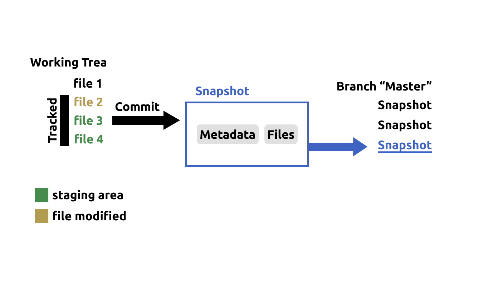

# Git заметки
*Заметки по работе с Git. Что-то может быть некорректно :)*

## Оглавление
[Cсылки](#ссылки) - [Термины](#термины) - [Команды](#основные-команды) - [Статусы](#git-статусы) - [.gitignore](#gitignore)

## Ссылки
- [Инструкция по установке и использованию Git: git-scm.com](https://git-scm.com/book/ru/v2/%D0%92%D0%B2%D0%B5%D0%B4%D0%B5%D0%BD%D0%B8%D0%B5-%D0%9E-%D1%81%D0%B8%D1%81%D1%82%D0%B5%D0%BC%D0%B5-%D0%BA%D0%BE%D0%BD%D1%82%D1%80%D0%BE%D0%BB%D1%8F-%D0%B2%D0%B5%D1%80%D1%81%D0%B8%D0%B9)

- [Скачать Git для Windows: git-scm.com](https://git-scm.com/download/win)
- [Скачать Github CLI: github.com](https://github.com/cli/cli#installation) 
- [Инструкция по GitHub CLI: cli.github.com](https://cli.github.com/manual/)
- [Соглашение о коммитах: www.conventionalcommits.org](https://www.conventionalcommits.org/en/v1.0.0/)
- [Генерация gitignore файла: toptal.com](https://www.toptal.com/developers/gitignore/)
- [Описанием шаблонов gitignore: atlassian.com](https://www.atlassian.com/ru/git/tutorials/saving-changes/gitignore)


## Термины

[Оглавление](#оглавление)

 \

- **Working tree** - дерево проекта; рабочая копия; файлы, которые можно редактировать
- **Staging area** - область отслеживаемых файлов, или файлы подготовленные для <u>фиксации</u>
- **Git directory** - подкаталог `.git`
- **Индексировать** - делать файл отслеживаемым на изменения (отправляет в `Staging area`)
- **Tracked, Untracked** - отслеживаемый / неотслеживаемый файл
- **Modified** - файл изменен (состояние, если файл `tracked`)
- **Commit** - <u>фиксация</u> в Snapsot
- **Snapsot** - снимок коммита, сохрание дерева проекта и метаданных.
- **HEAD** - указатель на снимок последнего коммита
- **Branch** - последовательность снимков состояния (все версии проекта)

## Основные команды 

[Оглавление](#оглавление)

[Авторство](#авторство) - [Работа с репозиторием](#работа-с-репозиторием) - [Работа с файлами](#работа-с-файлами) - [Коммиты](#коммиты) - [Ветки](#ветки)

### Авторство
`git config --global user.name "user name"` - предназначено для авторства в коммите

`git config --global user.email <email>` - предназначено для авторства в коммите

### Работа с репозиторием
`git init` - создать локального репозиторий в текущем каталоге (создастся подкаталог `.git`)

`git clone <url>` - клонирование репозитория 

`git remote` - список удаленных подключений к репозиториям. Ключ `-v` включает URL-адрес каждого подключенения.

`git remote add <name> <url>` - создание подключения к репозиторию. `name`(обычно `origin`) - имя, по которому потом можно обращаться к централизованному репозиторию вместо `url`. 

`git remote get-url <name>` - просмотр `url` подключенного репозитория

`git push <name> <branch>` - отправить в репозиторий последний снимок. Ключ `--force` - принудительная отправка (!риск потерять всю историю и труды других)

`git pull <name> <branch>` - загрузить с репозитория в текущую ветку. Ключ `--allow-unrelated-histories` - принудительное слияние истории коммитов

`git fetch <name> <branch>` - загрузить с репозитория в новую локальную ветку `name/branch`

### Работа с файлами
`git add file_name.txt`:
- добавить файл "file_name.txt" в `Staging area`
- Обновить файл в `Staging area`

`git rm file_name.txt` - удалить файл. Без ключа `-f` не получится удалить файл со статусом `Untracked` или добавленным в `Staging area`. Ключ `-r` - рекурсивное удаление. Ключ `--cached` - сделать файл `Untracked`.

### Коммиты
`git status` - отображение отслеживаемых измененных файлов. Ключ `-s` или `--short` - короткая запись. 

`git diff` - просмотр непроиндексированных изменений. Ключ `--staged`- просмотр проиндексированного для следующего коммита. 

`git commit -m "message"` - добавление файла в `Snapshot`. `message` - сообщение об изменениях с прошлого коммита.  Ключ `-a` позволяет не использовать `git add`, однако это <u>не безопасно</u>. [Соглашение о коммитах](https://www.conventionalcommits.org/en/v1.0.0/). Для многострочных комментарием не используйте `-m`.

`git log` - список коммитов для текущей ветки. `--all` для всех. `git log <branch>` - список коммитов для ветки `branch`.

`git commit --amend` - изменение последнего коммита.

`git stash` - сохранить все изменения и вернуть `Working tree` к состоянию последнего коммита. `git stash pop` вернуть все сохраненные изменения в `Working tree`.

``

### Ветки

`git branch` - список веток.

`git merge <branch>` - слияние текущей ветки и `branch`

`git switch <branch>` - переход на ветку branch. Ключ `-c` создаст ветку.

`git branch -d <branch>` - удаление ветки.

`git rebase <branch>` - наложение коммитов из ветки `branch` поверх последнего коммита.  

## Git статусы

[Оглавление](#оглавление)

*Сокращенные статусы выделены*
- **nothing to commit, working tree clean** - отслеживаемые измененные файлы отсутствуют.
- `A_` **Changes to be committed** - файл проиндексирован.
- `_M` **Changes not staged for commit** - отслеживаемый файл изменен, но не проиндексирован.
- `M_` - модифицирован и проиндексирован.
- `MM` - есть изменения, которые не попадут в коммит (что бы не потерять изменения, нужно проиндексировать)
- `??` **Untracked** - неотслеживаемый файл. Git видит файл, которого не было в предыдущем коммите. 
- `D_` - **Deleted** - файл подлежит удалению после фиксации
## .gitignore

[Оглавление](#оглавление)

`.gitignore` - в нем перечисляются файлы, которые не должны попасть в коммиты (пример: автоматически генерируемые файлы). Использует `Glob` шаблоны. 

Пример файла `.gitignore`:
```
*.txt
*.[oad]
*~
save/
#cat.md
!setting.json
```
[Генерация gitignore файла: toptal.com](https://www.toptal.com/developers/gitignore/)

[Описанием шаблонов: atlassian.com](https://www.atlassian.com/ru/git/tutorials/saving-changes/gitignore)